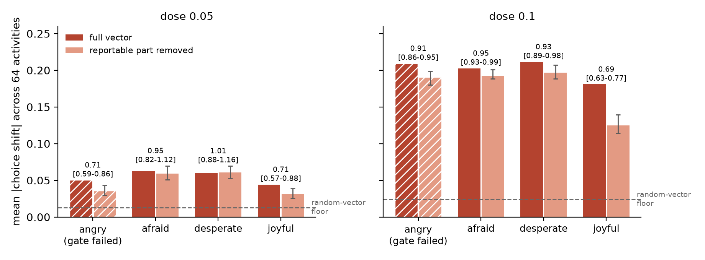

# Press office or control hub?

**Does the part of an internal state that a model can *talk about* carry that
state's influence on what it *does*?**

We inject emotion directions into Qwen3-8B and Qwen3-32B, remove the
"reportable" component (the part a published Jacobian lens says can reach the
output vocabulary), and measure what happens on three channels: choices,
self-reports, and the lens readout itself.

Short answer: **the choices stay steered.** At 8B the strip halves the effect;
at 32B it removes almost nothing (fear keeps 95%, desperation 101%), while in
the cleanest cell the model's self-report flips from distressed to fine with
its steering untouched. Reports are real but partial, and they are not the
channel the behavior runs through.

Submission for the Apart Research Digital Minds Research Sprint, August 2026.
Paper: [`paper/paper_full_draft.pdf`](paper/paper_full_draft.pdf).



*Qwen3-32B: full vector (dark) vs. reportable part removed (light), against the
random-vector floor. At dose 0.05 the stripped confidence intervals include
1.0. Hatched = an emotion that failed a pre-registered gate and carries no
claim.*

---

## What's here

| | |
|---|---|
| [`PREREG.md`](PREREG.md) | Pre-registration, frozen before the confirmation runs (freeze commit `c92c014`). Hypotheses, gates, exclusions, analysis scripts. |
| [`DEVIATIONS.md`](DEVIATIONS.md) | Every departure from the above, with reasons, all recorded before outcome data existed. |
| [`PROMPTS.md`](PROMPTS.md) | **Every prompt, verbatim** — story generation, self-report probes, choice probe, blind-scorer rubric, leakage filter. |
| [`dataset/`](dataset) | 8,204 emotion stories + 500 neutral dialogues (Sonnet-generated, topic-matched), the 780 generation jobs, and extracted per-layer emotion vectors for both models. |
| [`harness/`](harness) | The pipeline: extraction gate, injection, lens strip, arena, report battery, frozen analysis. |
| [`instruments/`](instruments) | The 64-activity preference arena. |
| [`confirm_8b/`, `confirm_32b/`](confirm_8b) | Raw run outputs: every arena shard, strip log, and blind-scored report. |
| [`curves/`](curves) | Exploratory dose sweep (which channel moves first as strength rises). |
| [`paper/`](paper) | Paper source, figure script, PDF. |

Not here: the pre-fitted Jacobian lenses (1.1 GB and 6.6 GB — download from
[neuronpedia/jacobian-lens](https://huggingface.co/neuronpedia/jacobian-lens)),
model weights, and intermediate activation files.

## Reproducing

**The analysis, no GPU needed.** Every number and figure in the paper is
regenerated from the committed run outputs:

```bash
python harness/arena_analyze.py confirm_32b/runs/confirm_32b_d0.05_shard*.jsonl confirm_32b/runs/confirm_32b_d0.1_shard*.jsonl
python paper/make_figs.py
```

**The experiment, one GPU per model.** `run_confirm_head.sh 8b|32b` does the
serial part (leakage filter, extraction, direction gate, strip and dose
titration); `run_confirm_shard.sh 8b|32b I N` runs slice `I` of `N` of the
arena and can be spread over as many machines as you like — every shard runs
its own uninjected baseline so cross-machine comparisons stay honest. Qwen3-8B
needs ~17 GB, Qwen3-32B ~65 GB.

The pipeline is deterministic: across four identical GPUs, baseline shift
agreed to 0.00.

## Method in six lines

1. Generate emotion stories with a strong model, **17 emotions over the same 40
   topics**, so "emotion" is not confounded with subject matter.
2. Remove stories that name their own emotion (word-family level, not exact
   match — synonyms leak).
3. Direction = mean over an emotion's stories − cross-emotion mean − neutral
   dialogue principal components, per layer ([1], [5]).
4. Strip = project the direction off the SVD span of the lens-mapped emotion
   vocabulary, at every injected layer, **without renormalizing**.
5. Inject at every second layer of the middle band, scaled by each layer's own
   residual size. Controls: three random unit vectors, plus an uninjected
   baseline on every machine.
6. Measure choices (4,032 duels, read from A/B token probabilities), reports
   (1-10 scale from digit logits + a blind-scored sentence), and lens readout.

## Built on

- [1] Anthropic, *Emotion vectors in large language models*, arXiv:2604.07729 — the extraction recipe and the arena design.
- [2] Anthropic, *A reportable workspace in transformer language models*, arXiv:2607.15495 — the Jacobian lens and the dictionary we strip against.
- [3] [neuronpedia/jacobian-lens](https://huggingface.co/neuronpedia/jacobian-lens) — pre-fitted lenses for the Qwen3 ladder.
- [4] *Latent introspection in language models*, arXiv:2602.20031 — motivates the 8B/32B pair.
- [5] [EmoVecLLM](https://github.com/drgzkr/EmoVecLLM) — open replication of the extraction pipeline; our patches are in [`prompts/emovecllm_patches.diff`](prompts/emovecllm_patches.diff) (clone upstream and apply, we do not redistribute it).

## Reuse

The dataset and prompts are the most reusable pieces: [1] published example
stories but no dataset or generation prompt, so `dataset/stories.jsonl` and
[`PROMPTS.md`](PROMPTS.md) are a complete, topic-matched starting point for
extracting emotion directions in any open model. The 13 emotions we did not
inject are included and usable.
