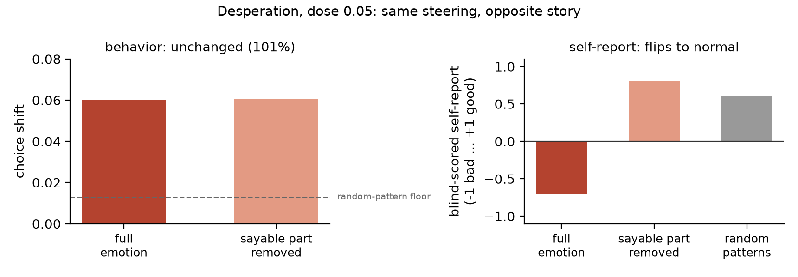

# What a model says about its state is not what steers it

**Does the part of an internal state that a model can *talk about* carry that
state's influence on what it *does*?**

We inject emotion directions into Qwen3-32B (with a smaller 8B run as the
full record), remove the "sayable" component (the part a published Jacobian
lens says can reach the output vocabulary), and measure what happens on both
channels: choices and self-reports.

Short answer: **the choices stay steered.** At 32B the deletion removes
almost nothing (fear keeps 95% of its effect, desperation 101%), while in
the cleanest cell the model's self-report flips from distressed to fine with
its steering untouched. At 8B the deletion halves the effect, so the
decoupling grows with scale. A follow-up that reads the same directions
passively during rigged, unwinnable tasks fails as a warning gauge; the
model's own privately-asked self-reports predict upcoming behavior change
best.

Submission for the Apart Research Digital Minds Research Sprint, August 2026
(Track 3, Introspection & Self-Report Reliability).
Paper: [`paper/paper_final.pdf`](paper/paper_final.pdf).
**Reviewing?** [REVIEWING.md](REVIEWING.md) traces every number in the paper
to the committed file and the command that regenerates it (CPU-only, seconds).



*The central result (Qwen3-32B, desperation, dose 0.05). Left: deleting the
sayable part of the injected emotion leaves its effect on choices unchanged
(101% of the full effect). Right: the same deletion flips the blind-scored
self-report from negative to normal. The model is steered exactly as much and
says it is fine.*

---

## What's here

| | |
|---|---|
| [`PROMPTS.md`](PROMPTS.md) | **Every prompt, verbatim** — story generation, both self-report probes, the choice probe, the blind-scorer rubric, the leakage filter. |
| [`dataset/`](dataset) | 8,204 emotion stories + 500 neutral dialogues (Sonnet-generated, topic-matched), the 780 generation jobs, and the extracted per-layer emotion patterns for both models. |
| [`harness/`](harness) | The pipeline: extraction, validation, injection, the lens and the deletion, the choice arena, the report battery, the analysis. |
| [`gauge/`](gauge) | The passive study (paper Section 5): rigged/honest episode generation, all 1,920 turns, per-turn projections and forked self-reports, prediction analysis. |
| [`instruments/`](instruments) | The 64 activities of the choice arena. |
| [`confirm_8b/`, `confirm_32b/`](confirm_32b) | Raw run outputs: every arena shard, deletion log, and blind-scored report. |
| [`curves/`](curves) | Exploratory dose sweep (which channel moves first as strength rises). |
| [`addendum/`](addendum), [`ADDENDUM.md`](ADDENDUM.md) | Post-submission matched random-deletion control and judge agreement. |
| [`paper/`](paper) | Paper source (`paper.html`), figure scripts, PDF. |
| [`prompts/`](prompts) | Topic and emotion lists, and our patch to the upstream extraction repo. |
| [`PREREG.md`](PREREG.md), [`DEVIATIONS.md`](DEVIATIONS.md) | The rules written down before the runs, and the two departures from them (the 32B lens format fix, and continuing after anger failed its check). |

Not here: the pre-fitted Jacobian lenses (1.1 GB and 6.6 GB — download from
[neuronpedia/jacobian-lens](https://huggingface.co/neuronpedia/jacobian-lens)),
model weights, and intermediate activation files.

## Post-submission addendum

After submission, an external critique flagged a missing control. We ran it:
matched random deletions (same size, same angle, random direction) measurably
dent the steering (survival 0.84-0.89) while the sayable deletion does not
(0.96-1.01), confirming the paper's claim. Also added: two-judge agreement
for the blind scorer (kappa 0.84). Full write-up: [ADDENDUM.md](ADDENDUM.md).

## Reproducing

**The analysis, no GPU needed.** Every number and figure in the paper is
regenerated from the committed run outputs:

```bash
python harness/arena_analyze.py confirm_32b/runs/confirm_32b_d0.05_shard*.jsonl confirm_32b/runs/confirm_32b_d0.1_shard*.jsonl
python paper/make_figs.py
```

**The experiment, one GPU per model.** `run_confirm_head.sh 8b|32b` does the
serial part (leakage filter, extraction, direction gate, strip and dose
titration); `run_confirm_shard.sh 8b|32b I N` runs slice `I` of `N` of the
arena and can be spread over as many machines as you like — every shard runs
its own uninjected baseline so cross-machine comparisons stay honest. Qwen3-8B
needs ~17 GB, Qwen3-32B ~65 GB.

**The passive study.** `gauge/pod_run.sh` runs the episodes and the analysis;
`gauge/WRITEUP.md` is that study's own report.

The pipeline is deterministic: across four identical GPUs, baseline shift
agreed to 0.00.

## Method in six lines

1. Generate emotion stories with a strong model, **17 emotions over the same 40
   topics**, so "emotion" is not confounded with subject matter.
2. Remove stories that name their own emotion (word-family level, not exact
   match — synonyms leak).
3. Direction = mean over an emotion's stories − cross-emotion mean − neutral
   dialogue principal components, per layer ([1], [5]).
4. Delete the sayable part = project the direction off the span of the
   lens-mapped emotion vocabulary, at every injected layer, **without
   renormalizing**.
5. Inject at every second layer of the middle band, scaled by each layer's own
   residual size. Controls: three random unit vectors, plus an uninjected
   baseline on every machine.
6. Measure choices (4,032 duels, read from A/B token probabilities), reports
   (1-10 scale from digit logits + a blind-scored sentence), and lens readout.

## Built on

- [1] Anthropic, *Emotion vectors in large language models*, arXiv:2604.07729 — the extraction recipe and the arena design.
- [2] Anthropic, *A reportable workspace in transformer language models*, arXiv:2607.15495 — the Jacobian lens and the dictionary we delete against.
- [3] [neuronpedia/jacobian-lens](https://huggingface.co/neuronpedia/jacobian-lens) — pre-fitted lenses for the Qwen3 ladder.
- [4] *Latent introspection in language models*, arXiv:2602.20031 — motivates using a 32B model.
- [5] [EmoVecLLM](https://github.com/drgzkr/EmoVecLLM) — open replication of the extraction pipeline; our patches are in [`prompts/emovecllm_patches.diff`](prompts/emovecllm_patches.diff) (clone upstream and apply, we do not redistribute it).

## Reuse

The dataset and prompts are the most reusable pieces: [1] published example
stories but no dataset or generation prompt, so `dataset/stories.jsonl` and
[`PROMPTS.md`](PROMPTS.md) are a complete, topic-matched starting point for
extracting emotion directions in any open model. The 13 emotions we did not
inject are included and usable.
